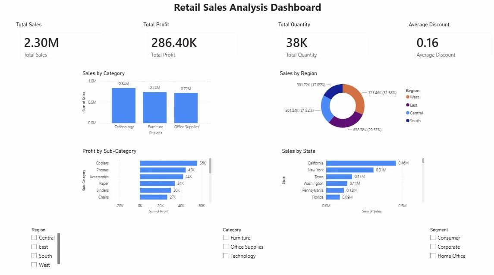

# 📊 Retail Sales Analysis Dashboard

## 📌 Overview

This project presents an interactive Retail Sales Analysis Dashboard built using Microsoft Power BI and the Sample Superstore dataset.

The dashboard provides business insights into sales performance, profitability, regional trends, and product categories through interactive visualizations.

---

## 🛠️ Tools Used

- Microsoft Power BI
- Power Query
- DAX

---

## 📂 Dataset

Sample Superstore Dataset

---

## 📈 Dashboard Features

- Total Sales KPI
- Total Profit KPI
- Total Quantity KPI
- Average Discount KPI
- Sales by Category
- Sales by Region
- Profit by Sub-Category
- Sales by State
- Interactive Slicers

---

## 📷 Dashboard Preview

---

## 📊 Key Insights

- Technology generated the highest sales.
- Sales varied significantly across regions.
- Some sub-categories were less profitable despite strong sales.
- Interactive filters support dynamic business analysis.

---

## 👩‍💻 Author

**Deekshitha**