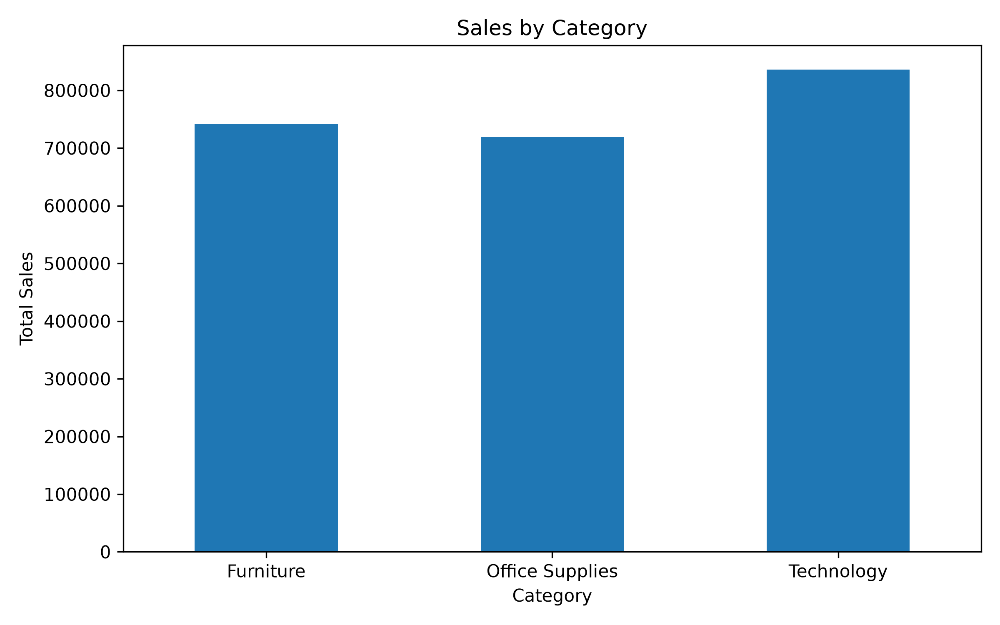
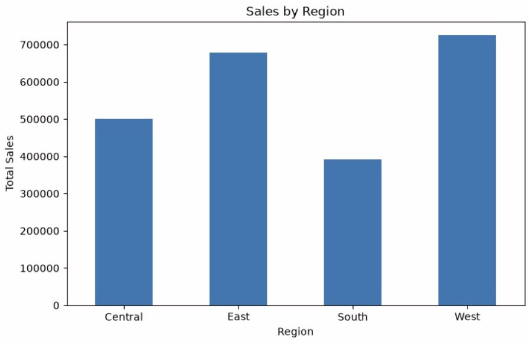
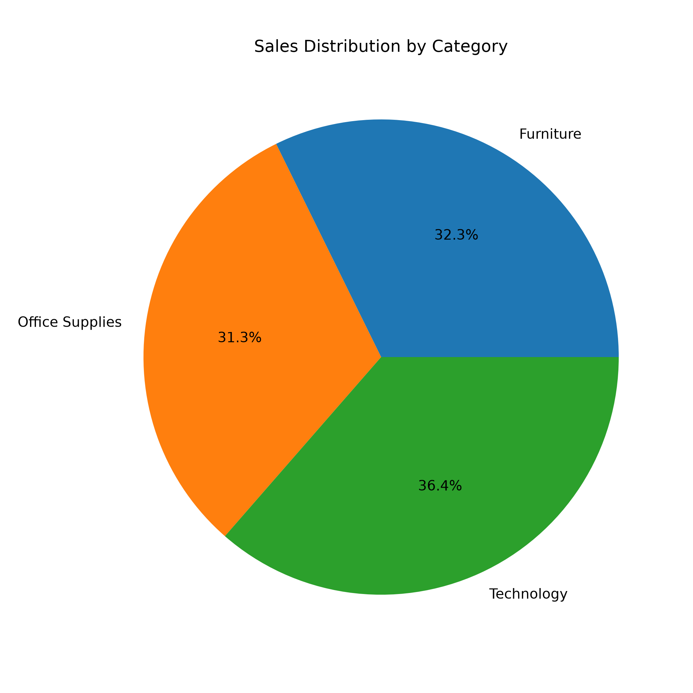
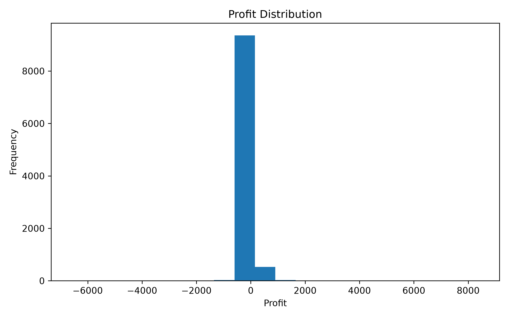
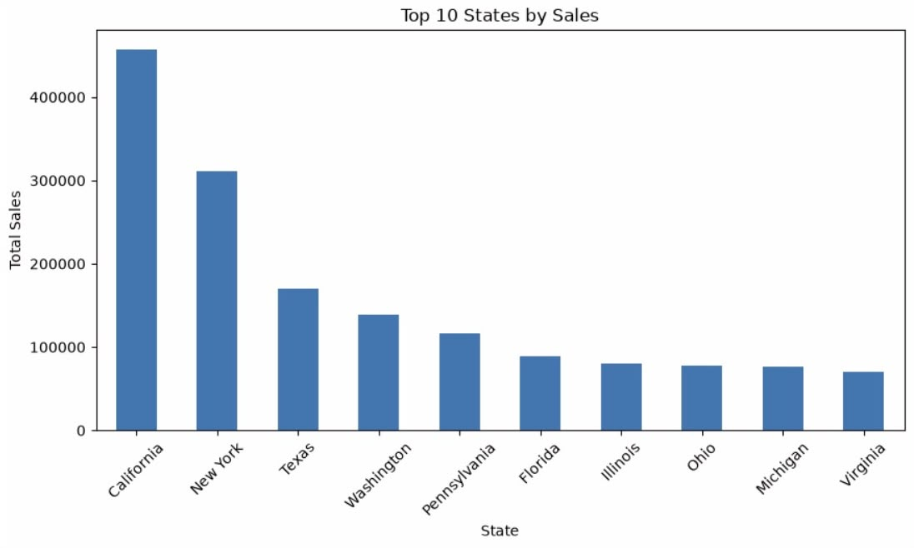

# 📊 Sales Data Analysis Using Python

## 📌 Project Overview

This project analyzes retail sales data using Python to uncover business insights through data exploration, cleaning, and visualization. The analysis demonstrates a complete data analytics workflow using Python libraries such as Pandas, NumPy, and Matplotlib.

---

## 🎯 Objectives

- Load and explore the sales dataset
- Clean and prepare the data
- Perform Exploratory Data Analysis (EDA)
- Visualize sales performance
- Extract meaningful business insights

---

## 🛠️ Tools & Technologies

- Python
- Pandas
- NumPy
- Matplotlib
- Jupyter Notebook

---

## 📂 Project Structure

```
Python-Sales-Data-Analysis/
│
├── dataset/
├── notebook/
├── screenshots/
├── requirements.txt
├── .gitignore
└── README.md
```

---

## 📊 Visualizations

This project includes visualizations such as:

- Sales by Category
- Sales by Region
- Sales Distribution by Category
- Profit Distribution
- Top 10 States by Sales

---

## 📈 Key Insights

- Identified top-performing product categories based on sales.
- Analyzed regional sales performance.
- Explored profit distribution across transactions.
- Highlighted the highest-performing states by sales.

---

## 🚀 How to Run

1. Clone the repository.
2. Install the required libraries:

```bash
pip install -r requirements.txt
```

3. Open the Jupyter Notebook.
4. Run all cells sequentially.

---

## 📌 Future Improvements

- Add advanced visualizations using Seaborn and Plotly.
- Build an interactive dashboard.
- Perform predictive analytics using machine learning.

---

## 👩‍💻 Author

**Palakala Deekshitha**

- LinkedIn: *(add your LinkedIn profile link)*
- GitHub: *(add your GitHub profile link)*


## 📸 Dashboard & Visualizations

### Sales by Category


### Sales by Region


### Sales Distribution by Category


### Profit Distribution


### Top 10 States by Sales
