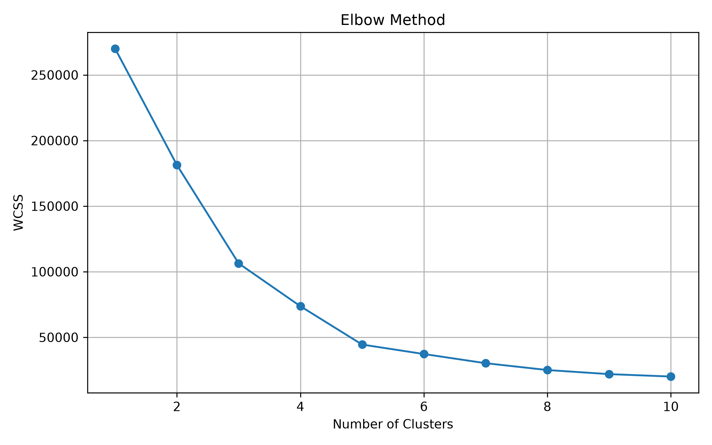
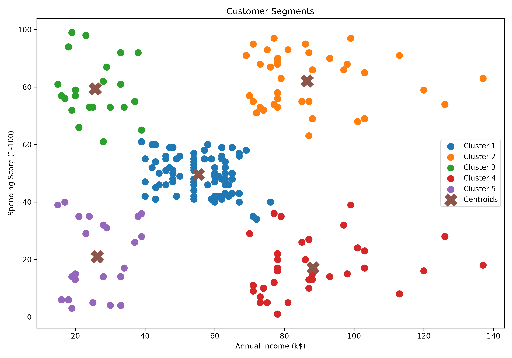

# 👥 Customer Segmentation Analysis using Machine Learning

## 📌 Project Overview

This project applies the K-Means clustering algorithm to segment customers based on Annual Income and Spending Score. Customer segmentation helps businesses understand different customer groups and develop targeted marketing strategies.

---

## 🎯 Objectives

- Load and explore the customer dataset
- Clean and preprocess the data
- Perform exploratory data analysis
- Apply K-Means clustering
- Determine the optimal number of clusters using the Elbow Method
- Visualize customer segments
- Generate business insights

---

## 🛠️ Tools & Technologies

- Python
- Pandas
- NumPy
- Matplotlib
- Scikit-learn
- Jupyter Notebook

---

## 📂 Project Structure

```
04-Customer-Segmentation-Analysis/
│
├── dataset/
├── notebook/
├── screenshots/
├── README.md
├── requirements.txt
└── .gitignore
```

---

## 📈 Key Insights

- The Elbow Method identified 5 as the optimal number of customer clusters.
- Premium customers (high income, high spending) can be targeted with loyalty programs.
- High-income customers with low spending represent opportunities for personalized marketing.
- Customer segmentation enables data-driven marketing strategies.

---

## 🚀 How to Run

1. Clone the repository.
2. Install dependencies:

```bash
pip install -r requirements.txt
```

3. Open the notebook.
4. Run all cells sequentially.

---

## 📌 Future Improvements

- Include additional customer features such as Age and Gender.
- Compare K-Means with DBSCAN and Hierarchical Clustering.
- Build an interactive dashboard for customer insights.

---

## 📸 Visualizations

### Elbow Method


### Customer Segments



## 👩‍💻 Author

**Palakala Deekshitha**

